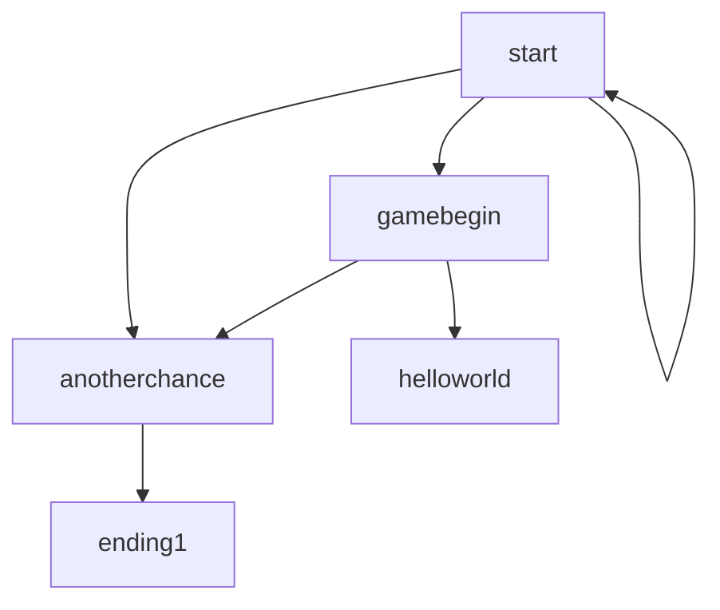

# Hello, World!
A text game written in Python that teaches you Python.

(Screenshot)
**Play at: (pyterm link)**

## Features and Description
- No installation required: playable in browser via PyTerm
- 

_Hello, World!_ is a psychological horror, metafiction text game written in Python that is designed to teach the user some of the basics of Python.

The file **main.py** is written with comments in order to be optionally read as part of the game.

Topics covered in the game:
-print()
-input()
-comment
-variables
-data types
-lists and arrays
-loops
-if/elif/else


## Usage
The game branches based on user input, such as:
- y/n input

```python
#Example from definition of function "start()"
    x = input("Begin? y/n ")
    if x == "y":
        ...
    elif x == "n":
        ...
    else:
        ...
```
- Guided input
```python
#Example from definition of function "gamebegin()"
    print("Type the command below. Type exactly as it is written.")
    print("print("Hello, World!")")
    x = input()
    if x == "print("Hello, World!")" :
        ...
    else:
        ...
```

### Program structure 


## Acknowledgements
- Used [this file](https://gist.github.com/rene-d/9e584a7dd2935d0f461904b9f2950007) by rene-d for checking ANSI escape codes to make colored text
- Used various websites online for debugging
- Used the Python documentation for guidance and ideas. 
- Used Mermaid Documentation for help with diagrams.
- Used Wikipedia for the history of Python.
Everything else is fully original and no AI was used to write the code. 
