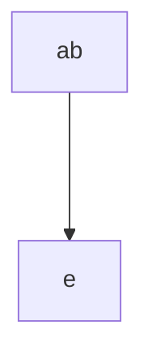

# Hello, World!
A text game written in Python that teaches you Python.

**Play at: (pyterm link)**

## Features and Description
- No installation required: playable in browser via PyTerm
- 

_Hello, World!_ is a psychological horror, metafiction text game that is designed to teach Python, while also making use of is

The file **main.py** is written with comments in order to be optionally read as part of the game.

## Usage
The game branches based on user input, such as:
- y/n input

```python
#Example from definition of function "start()"
    x = input("Begin? y/n ")
    if x == "y":
        ...
    elif x == "n":
        ...
    else:
        ...
```
- Guided input
```python
#Example from definition of function "gamebegin()"
    print("Type the command below. Type exactly as it is written.")
    print("print("Hello, World!")")
    x = input()
    if x == "print("Hello, World!")" :
        ...
    else:
        ...
```




## Acknowledgements

